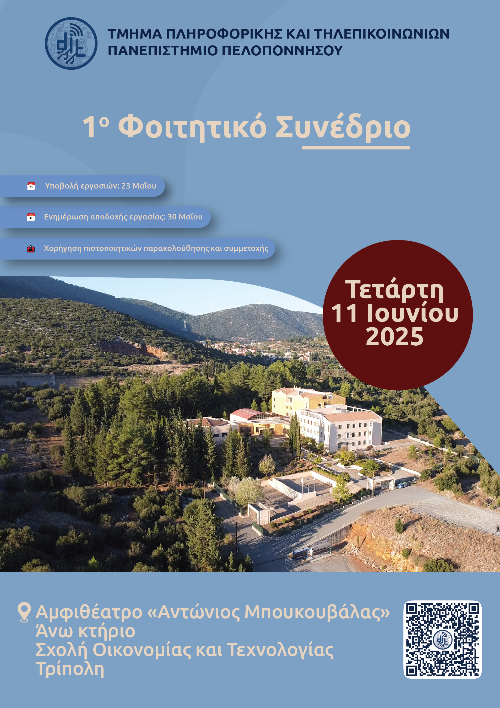

# 1ο Φοιτητικό Συνέδριο Τμήματος Πληροφορικής και Τηλεπικοινωνιών  
**Πανεπιστήμιο Πελοποννήσου**  
  
  

## Περιγραφή  
Το παρόν αποθετήριο περιέχει το πρότυπο **LaTeX** για τις εργασίες που θα σταλούν στο 1ο Φοιτητικό Συνέδριο του Τμήματος Πληροφορικής και Τηλεπικοινωνιών του Πανεπιστημίου Πελοποννήσου.

---

## Οδηγίες Χρήσης  

| Βήμα | Περιγραφή                                                                 |
|------|---------------------------------------------------------------------------|
| 1    | **Κατεβάστε το αποθετήριο:** Το αρχείο αποθετήριο περιέχει όλα όσα χρειάζεστε. |
| 2    | **Δομή Εργασίας:** Χρησιμοποιήστε το πρότυπο **main.tex** για το κείμενο της εργασίας σας. |
| 3    | **Βιβλιογραφικές Αναφορές:** Ακολουθήστε το πρότυπο **sample.bib** για τις βιβλιογραφικές αναφορές. |
| 4    | **Preamble:** Είναι απαραίτητο να χρησιμοποιήσετε το αρχείο **inputs.tex**. |
| 5    | **Παραγόμενο Αρχείο:** Το τελικό αποτέλεσμα θα εμφανίζεται στο αρχείο **DITConf2025_Template.pdf**. |

---

## Προθεσμία Υποβολής  
**23 Μαΐου 2025**

---

## Περισσότερες Πληροφορίες  
Για περισσότερες πληροφορίες, επισκεφθείτε τη σελίδα:  

---

## Επικοινωνία  
Για ερωτήσεις ή διευκρινίσεις, επικοινωνήστε μαζί μας:  
📧 Email: [kseklou@uop.gr](mailto:kseklou@uop.gr)  
🌐 Website: [https://dit.uop.gr/studentconf](https://dit.uop.gr/studentconf)
